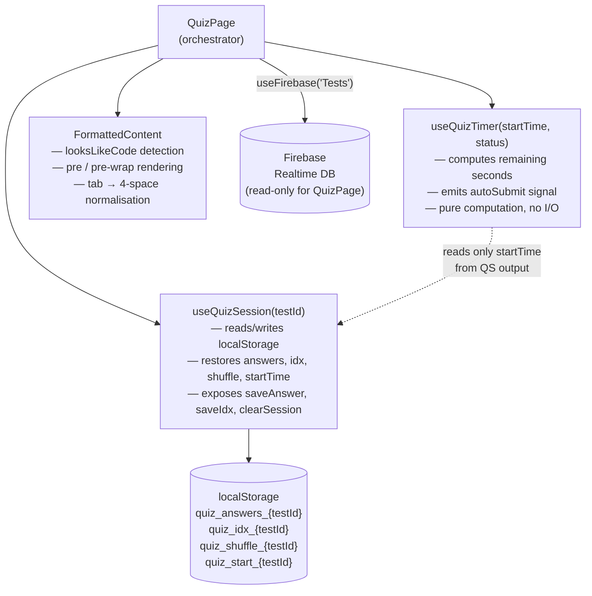
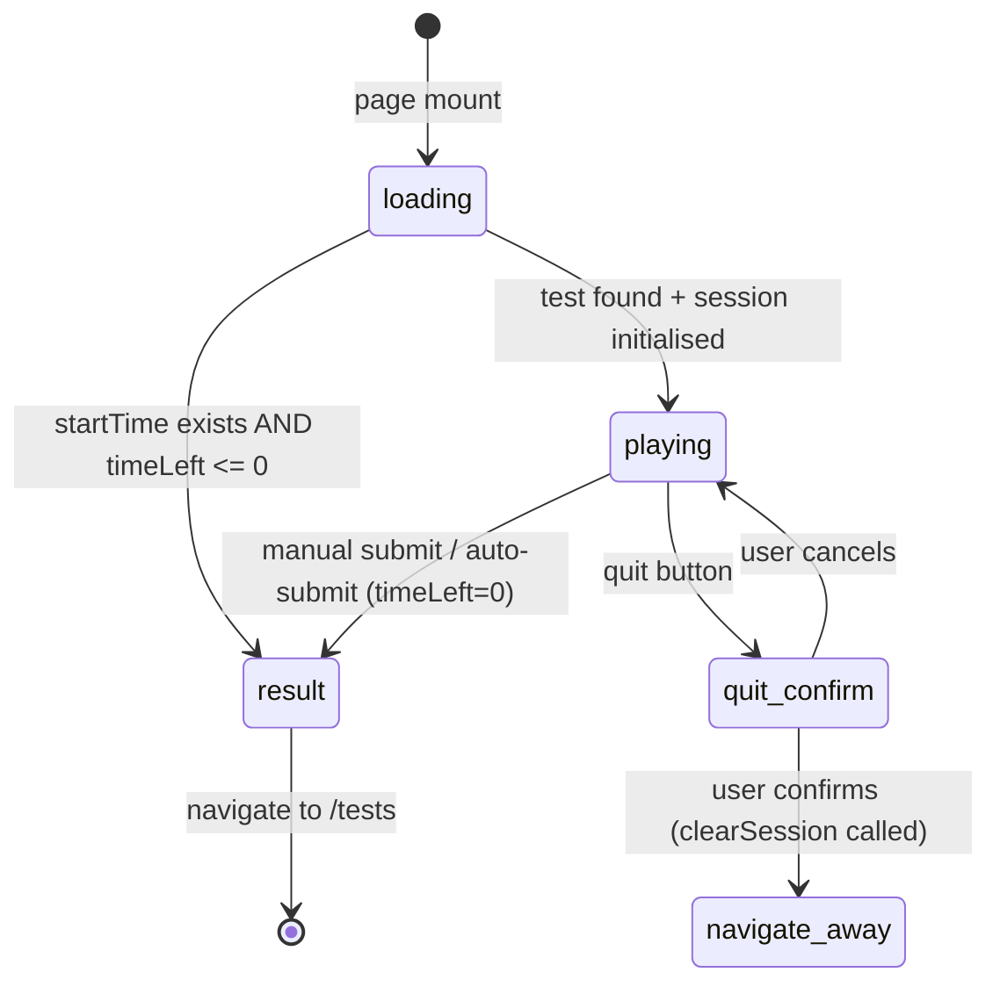

# Design Document: Test System Improvements

## Overview

This design refactors `src/pages/QuizPage.jsx` (880 lines) to introduce two focused custom hooks — `useQuizSession` and `useQuizTimer` — that extract the localStorage persistence and timer logic currently tangled inside the component. The result is a `QuizPage` that reads cleanly as an orchestrator: it delegates session state to `useQuizSession`, delegates countdown computation to `useQuizTimer`, and focuses its own render logic on UI layout, navigation, and PDF generation.

The `FormattedContent` component already exists in `QuizPage.jsx` and already handles code detection via `looksLikeCode`. This design verifies it meets all acceptance criteria and documents precisely what "code detection" means so future changes stay in spec.

### Goals

- **Zero progress loss**: answers, current index, shuffle order, and elapsed time survive any browser close or refresh.
- **Honest timer**: the timer is anchored to a wall-clock `startTime` stored in localStorage; no extra time is granted by refreshing.
- **Fixed 60-minute cap**: hardcoded `TOTAL_SECONDS = 3600`, ignoring any `duration` field from Firebase.
- **Clean separation**: session I/O lives entirely in `useQuizSession`; timer arithmetic lives entirely in `useQuizTimer`; `QuizPage` owns UI and orchestration only.

### Non-goals

- No backend persistence — all state stays in `localStorage` (client-only).
- No multi-tab sync — two open tabs for the same `testId` are not coordinated.
- No change to the Firebase data model or `useFirebase` hook.

---

## Architecture



**Data flow on mount:**
1. `QuizPage` fetches test data via `useFirebase('Tests')`.
2. `useQuizSession(testId)` runs — detects existing keys → restore; no keys → new session (generate shuffle, write `startTime`).
3. `useQuizTimer(startTime, status)` starts ticking using the `startTime` from `useQuizSession`.
4. `QuizPage` renders questions in shuffle order; each answer click calls `saveAnswer` from `useQuizSession`.

---

## Components and Interfaces

### `useQuizSession(testId)`

**File:** `src/hooks/useQuizSession.js`

```js
// Return type (all values are stable references)
{
  // Restored or freshly-initialised state
  answers: Record<string, string>,       // { [_qid]: optionLetter }
  currentIdx: number,                    // 0-based question index
  shuffleMap: number[] | null,           // ordered question indices; null until questions are provided
  startTime: number | null,              // Date.now() value, ms epoch

  // Whether we resumed (used to show banner)
  isResumed: boolean,

  // Mutators (all wrapped in try/catch; fall back to in-memory on localStorage error)
  saveAnswer: (qid: string, letter: string) => void,
  saveIdx:    (idx: number) => void,
  initShuffle: (map: number[]) => void,  // only writes if no existing shuffle map
  clearSession: () => void,              // removes all 4 keys
}
```

**Internal localStorage keys** (constants):
```js
const KEYS = {
  answers:  () => `quiz_answers_${testId}`,
  idx:      () => `quiz_idx_${testId}`,
  shuffle:  () => `quiz_shuffle_${testId}`,
  start:    () => `quiz_start_${testId}`,
}
```

**Initialisation logic** (runs once on mount via `useMemo` / `useRef`):
```
if quiz_start_{testId} exists in localStorage:
    isResumed = true
    restore answers, idx, shuffleMap from localStorage
    startTime = storedStartTime  (do NOT overwrite)
else:
    isResumed = false
    answers = {}
    idx = 0
    shuffleMap = null          (caller provides it via initShuffle)
    startTime = Date.now()
    write quiz_start_{testId} = startTime
```

**Error handling**: every `localStorage.getItem` / `setItem` / `removeItem` call is wrapped in `try/catch`. On failure: log to console, continue with in-memory value, do not rethrow.

---

### `useQuizTimer(startTime, status)`

**File:** `src/hooks/useQuizTimer.js`

```js
// Parameters
startTime: number | null    // ms epoch from useQuizSession
status: 'playing' | 'result' | 'loading'

// Return type
{
  timeLeft: number,          // seconds remaining (never goes below 0)
  autoSubmit: boolean,       // true when timeLeft hits 0 while status==='playing'
}
```

**Implementation contract:**
- `TOTAL_SECONDS = 3600` is a module-level constant; it is never read from Firebase.
- `timeLeft` is computed on every tick as:
  ```js
  Math.max(0, TOTAL_SECONDS - Math.floor((Date.now() - startTime) / 1000))
  ```
- The interval fires every 1 000 ms while `status === 'playing'` and `startTime !== null`.
- On mount (or when `startTime` changes), compute `timeLeft` immediately (synchronous) — this handles the "expired on page load" case.
- `autoSubmit` is set to `true` in the same tick that `timeLeft` reaches 0.
- The hook is pure I/O: it **never** reads or writes localStorage.

---

### `FormattedContent` (existing, verified)

**Location:** inline in `src/pages/QuizPage.jsx` (to remain there; no extraction needed).

The component already satisfies all requirements. The design documents its contract for clarity:

| Condition | Rendering |
|-----------|-----------|
| `looksLikeCode(text) === true` | `white-space: pre`, monospace font, overflow-x scroll |
| `looksLikeCode(text) === false` | `white-space: pre-wrap`, body font |

**`looksLikeCode` detection rules** (from existing implementation):
1. Any line has ≥ 2 leading spaces or tabs.
2. Line starts with a Python/JS keyword: `def`, `class`, `for`, `while`, `if`, `elif`, `else`, `try`, `except`, `finally`, `with`, `import`, `from`, `print`, `return`, `console.log`, `var`, `let`, `const`, `public`, `static`, `void`.
3. Python interactive prompt `>>>` or common built-in calls followed by `(`.
4. Block-ending colon followed by indented body `:\s*\n\s+`.

**`normalizeText` contract:**
- `\r\n` → `\n`
- `\t` → `    ` (exactly 4 spaces)
- All other characters pass through unchanged.

---

### Navigation Guard (in `QuizPage`)

The existing `useEffect` that adds `beforeunload` / `popstate` listeners is retained as-is in `QuizPage`, updated only to use the correct quit confirmation text from requirements and to call `clearSession` before navigating away. No separate hook is introduced for this — it is two event listeners and belongs in the component.

**`popstate` dialog message:** `"Are you sure? Your test is currently running. Do you really want to leave this page?"`

**Lifecycle:**
```
status === 'playing'  →  listeners attached
status !== 'playing'  →  listeners removed (useEffect cleanup)
```

---

### `QuizPage` changes summary

| Area | Before | After |
|------|--------|-------|
| Timer state | `useState(0)`, `useEffect` with `setInterval`, seeded from `test.duration` | `useQuizTimer(startTime, status)` |
| answers state | `useState({})`, no persistence | `useQuizSession` provides `answers`, `saveAnswer` |
| Question index | `useState(0)`, no persistence | `useQuizSession` provides `currentIdx`, `saveIdx` |
| Shuffle | `useMemo` with inline Fisher-Yates, no persistence | `useQuizSession` provides/persists `shuffleMap`; `QuizPage` applies it |
| Auto-submit | None | `useEffect` watching `autoSubmit` from `useQuizTimer` |
| Resume banner | None | Rendered when `isResumed === true` |
| Session cleanup | None | `clearSession()` called on result transition and quit |

---

## Data Models

### localStorage key schema

| Key | Type | Description |
|-----|------|-------------|
| `quiz_answers_{testId}` | `JSON string → Record<string, string>` | `{ [_qid]: "a" \| "b" \| "c" \| "d" }` |
| `quiz_idx_{testId}` | `JSON string → number` | 0-based current question index |
| `quiz_shuffle_{testId}` | `JSON string → number[]` | Ordered array of original question indices |
| `quiz_start_{testId}` | `JSON string → number` | `Date.now()` value at session start (ms epoch) |

### Shuffle Map semantics

The `shuffleMap` is an array of original question indices. For a test with 40 questions, `shuffleMap[0] = 27` means the first displayed question is `rawQuestions[27]`.

Option shuffle is stored inside each entry of `shuffleMap` as a parallel `optionOrder` array per question. Concrete representation:

```ts
type ShuffleMap = Array<{
  qIdx: number,          // index into original rawQuestions array
  optionOrder: string[], // e.g. ['c', 'a', 'd', 'b'] — shuffled display order
}>
```

`getCorrectOption(q)` always operates on the original question object `rawQuestions[entry.qIdx]`, never on the shuffled option position. The displayed option letter comes from `entry.optionOrder[displayIndex]`, but the stored answer letter is that same original letter — so answer persistence is unambiguous.

### Session state machine



---

## Correctness Properties

*A property is a characteristic or behavior that should hold true across all valid executions of a system — essentially, a formal statement about what the system should do. Properties serve as the bridge between human-readable specifications and machine-verifiable correctness guarantees.*

---

### Property 1: Code detection is input-universal

*For any* string that contains at least one line with two or more leading spaces (or tabs), `looksLikeCode(normalizeText(value))` SHALL return `true`.

**Validates: Requirements 1.1, 1.3**

---

### Property 2: Python keyword detection is input-universal

*For any* string that contains at least one line beginning with a Python keyword from the required set (`def`, `class`, `for`, `while`, `if`, `elif`, `else`, `try`, `except`, `finally`, `with`, `import`, `from`, `print`, `return`), `looksLikeCode(text)` SHALL return `true`.

**Validates: Requirements 1.2**

---

### Property 3: Tab normalisation round-trip

*For any* string containing one or more tab characters (`\t`), `normalizeText(value)` SHALL contain no tab characters and SHALL contain at least one occurrence of four consecutive spaces.

**Validates: Requirements 1.3**

---

### Property 4: Non-code prose detection

*For any* string that contains no indentation of two or more leading spaces, no Python keywords at line start, no `>>>` prompts, and no block-ending-colon pattern, `looksLikeCode(text)` SHALL return `false`.

**Validates: Requirements 1.4**

---

### Property 5: Timer hardcoded to 3600 seconds

*For any* Firebase test record containing any `duration` field value (including absent, zero, negative, or arbitrary positive numbers), `useQuizTimer` SHALL use exactly 3600 as the total duration when computing `timeLeft`.

**Validates: Requirements 2.1, 2.3**

---

### Property 6: Remaining time formula correctness

*For any* `startTime` value in the range `[Date.now() - 3 600 000, Date.now()]`, `computeRemainingTime(startTime)` SHALL equal `Math.max(0, 3600 - Math.floor((Date.now() - startTime) / 1000))`.

**Validates: Requirements 2.3, 3.1**

---

### Property 7: startTime immutability on resume

*For any* `testId` where `quiz_start_{testId}` is already present in localStorage with value `T`, calling `useQuizSession(testId)` SHALL leave `quiz_start_{testId}` unchanged (still equal to `T`) after initialisation.

**Validates: Requirements 3.2, 8.3**

---

### Property 8: Expired session triggers immediate auto-submit

*For any* `startTime` value where `Date.now() - startTime >= 3 600 000` (i.e. remaining time is zero or negative), `useQuizTimer(startTime, 'playing')` SHALL return `{ timeLeft: 0, autoSubmit: true }` on the very first evaluation, without waiting for a timer tick.

**Validates: Requirements 3.3, 4.1, 6.4**

---

### Property 9: Session round-trip completeness

*For any* combination of `testId` (non-empty string), `answers` (Record<string, string>), `currentIdx` (non-negative integer), `shuffleMap` (array of shuffle entries), and `startTime` (positive integer), storing all four values via `useQuizSession` mutators and then reading them back via a fresh `useQuizSession(testId)` call SHALL produce objects deeply equal to the originals.

**Validates: Requirements 6.1, 6.3, 7.1, 7.2, 7.3, 7.4, 8.1, 8.2**

---

### Property 10: Session cleanup completeness

*For any* `testId` where all four localStorage keys are set, calling `clearSession()` SHALL result in all four keys (`quiz_answers_{testId}`, `quiz_idx_{testId}`, `quiz_shuffle_{testId}`, `quiz_start_{testId}`) being absent from localStorage.

**Validates: Requirements 4.4, 9.1, 9.2**

---

### Property 11: Correct answer invariant under option shuffle

*For any* question object `q` and *for any* permutation of its available option letters applied to produce a re-ordered display, `getCorrectOption(q)` SHALL return the same letter regardless of what permutation was applied, because it always reads from the original question fields.

**Validates: Requirements 8.4**

---

### Property 12: localStorage error resilience

*For any* localStorage operation (read or write) that throws an exception (e.g. quota exceeded, SecurityError in private browsing), `useQuizSession` SHALL catch the exception, log it to the console, and return or retain a valid in-memory state without re-throwing.

**Validates: Requirements 9.3**

---

## Error Handling

### localStorage failures

All reads and writes inside `useQuizSession` are wrapped in individual `try/catch` blocks. The pattern is:

```js
function safeGet(key, fallback) {
  try {
    const raw = localStorage.getItem(key)
    return raw !== null ? JSON.parse(raw) : fallback
  } catch (err) {
    console.error(`[useQuizSession] localStorage read failed for ${key}:`, err)
    return fallback
  }
}

function safeSet(key, value) {
  try {
    localStorage.setItem(key, JSON.stringify(value))
  } catch (err) {
    console.error(`[useQuizSession] localStorage write failed for ${key}:`, err)
    // Silently continue; in-memory state is already correct
  }
}

function safeRemove(key) {
  try {
    localStorage.removeItem(key)
  } catch (err) {
    console.error(`[useQuizSession] localStorage remove failed for ${key}:`, err)
    // Log and proceed — do not block the result view
  }
}
```

When localStorage is entirely unavailable (e.g. private browsing with strict settings), `useQuizSession` returns valid default state and all mutators operate only on React state. The quiz runs in-memory only.

### Timer edge cases

- `startTime === null`: `useQuizTimer` returns `{ timeLeft: TOTAL_SECONDS, autoSubmit: false }` and does not start the interval until `startTime` is set.
- `startTime` in the future (clock skew): `timeLeft` is clamped to `TOTAL_SECONDS` via `Math.max`.
- `timeLeft === 0` on mount: `autoSubmit` is set to `true` synchronously in the initial render effect.

### Firebase unavailable

The existing `useFirebase` hook already handles timeouts (10 s) and falls back to a cached localStorage value (`fb_cache_Tests`). `QuizPage` shows a loading skeleton while `loading === true` and an error state if `test === null` after loading completes. No changes needed here.

### Navigation guard — popstate race

`window.history.pushState(null, '', window.location.href)` is called once on mount when `status === 'playing'` to ensure a history entry exists for the popstate handler to cancel. If the user navigates forward before the page loads, this entry is added anyway.

---

## Testing Strategy

No property-based testing library is currently in the project (`package.json` has no test runner). The testing strategy specifies what to add:

**Add Vitest** (matches the existing Vite build pipeline):

```bash
npm install --save-dev vitest @vitest/coverage-v8 fast-check
```

**Test file locations:**

```
src/
  hooks/
    useQuizSession.test.js
    useQuizTimer.test.js
  pages/
    QuizPage.looksLikeCode.test.js   # pure function tests
```

### Unit tests (example-based)

- `useQuizSession`: new session writes all 4 keys; resume banner is set; quit clears all 4 keys; correct quit prompt text.
- `useQuizTimer`: `timeLeft` initial value when `startTime = Date.now()` is close to 3600; expired session returns `autoSubmit: true` immediately.
- `FormattedContent`: renders `<pre>` for indented code; renders `<div>` with `white-space: pre-wrap` for prose.
- Navigation guard: `beforeunload` handler prevents default; `popstate` confirm-cancel pushes state back.

### Property-based tests (fast-check)

Each property below is implemented as a single fast-check `fc.property` assertion running a minimum of **100 iterations**.

Tag format used in test comments: `// Feature: test-system-improvements, Property N: <property text>`

| Test file | Properties covered |
|-----------|--------------------|
| `useQuizSession.test.js` | Properties 7, 9, 10, 12 |
| `useQuizTimer.test.js` | Properties 5, 6, 8 |
| `QuizPage.looksLikeCode.test.js` | Properties 1, 2, 3, 4, 11 |

**Example property test skeleton:**

```js
import { describe, it, expect, vi, beforeEach } from 'vitest'
import fc from 'fast-check'

// Feature: test-system-improvements, Property 3: Tab normalisation round-trip
describe('normalizeText', () => {
  it('Property 3: removes all tabs and inserts 4-space sequences', () => {
    fc.assert(
      fc.property(
        fc.string().filter(s => s.includes('\t')),
        (value) => {
          const result = normalizeText(value)
          expect(result).not.toContain('\t')
          expect(result).toContain('    ')
        }
      ),
      { numRuns: 100 }
    )
  })
})
```

**Dual testing rationale:**
- Unit/example tests catch concrete regressions from specific bugs (wrong key name, wrong message text).
- Property tests validate that the logic holds universally — they catch bugs invisible to hand-picked examples (e.g. a shuffle permutation that accidentally corrupts the correct answer for a specific question arrangement).
